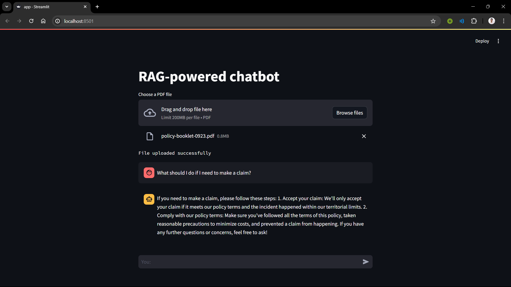

# RAG-powered chatbot for PDF Question Answering

This Streamlit app serves as a chatbot interface for answering questions based on content extracted from PDF files. It utilizes various libraries and tools for natural language processing and information retrieval. The app uses the llama2 open-source LLM and Ollama for running the model locally.



## Installation

1. Clone the repository:

    ```bash
    git clone https://github.com/shrut-vanpariya/RAG-powered-chatbot.git
    ```

2. Install the required dependencies:

    ```bash
    pip install -r requirements.txt
    ```

## Usage

1. Run the Streamlit app:

    ```bash
    streamlit run app.py
    ```

2. Upload a PDF file using the file uploader widget.

3. Ask questions related to the content of the uploaded PDF file.

4. The chatbot will respond with relevant answers based on the content of the PDF.

## Dependencies

- `streamlit`: Streamlit library for building interactive web applications.
- `langchain`: Library for handling natural language processing tasks.
- `langchain_community`: Community extensions for additional functionalities.
- Other required libraries as specified in `requirements.txt`.

## Configuration

- The app is configured to use a specific template for generating responses.
- PDF files are saved in the `pdfFiles` directory.
- Vector embeddings are stored in the `vectorDB` directory.

## Components

### User Interface

- File Uploader: Allows users to upload PDF files.
- Chat Input: Enables users to interact with the chatbot by typing questions.
- Chat Messages: Displays conversation history between the user and the chatbot.

### Backend

- PDF Loader: Loads and extracts text content from uploaded PDF files.
- Text Splitter: Splits large text documents into smaller chunks for processing.
- Vector Store: Stores vector embeddings of text documents for efficient retrieval.
- Question-Answering Chain: Utilizes a retrieval-based question-answering approach to generate responses.
